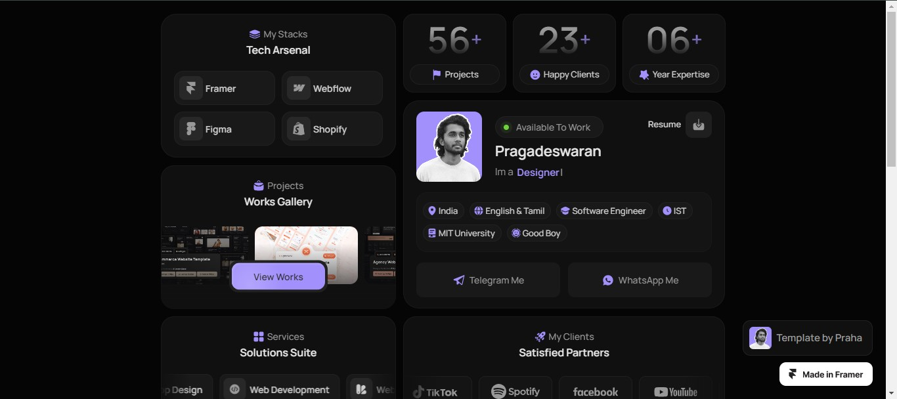

# TEMPLATE PERSONAL PORFOLIO

Este proyecto esta basado en aprender nuevas técnicas de desarrollo en el área del frontend.
Crearemos una template para un portafolio personal utilizando astro y tailwind.
Este proyecto será de código abierto.

## Tarea 1

- [✔] Limpiar toda la base template de astro.
- [✔] Instalar la fuente que se utliza en el proyecto.
- [✔] Configuracion de paleta de colores con tailwind.
- [✔] Personalizar Favicon.
- [✔] Obtener iconos de las 6 primeras secciones.
- [✔] dividr todas las secciones del template.
- [✔] Crear página 404 personalizada.

## Tarea 2
- [✔] Agregar animación en los botones con borde animado.
- [_] Poner otra sombra con el filter shadow.
- [✔] Agregar animación en disponible para trabajar.
- [_] En pagina 404 faltar adecuar bien el footer.
- [_] Animar la aparicion de cards en version desktop.
- [✔] Añadir el icono de resume en version desktop dentro de about.

## Tarea 3
- [_] Solucionar los saltos en la animacipon en my clients.
- [_] Optimizacion de imagenes.

## Tarea 4
- [_] Agregar las animaciones horizontalmente que son las únicas que faltan.
- [_] Ajustar página que por alguna razón crecieron divs contenedores.
- [_] Agregar hover en followLit.
- [_] Habilitar descarga del curriculum.
- [✔] El responsive de la página solo esta hasta 810px falta para pantallas más grandes 1420px.
- [_] Ajustar personalLit en 810px exatamente.
- [✔] En workflow 1440px ya de funcionan los link si no se aplica un hover y mostar el contenido.

## Tarea 5
- [_] Se reutiliar un componente que contiene casi el mismo código.